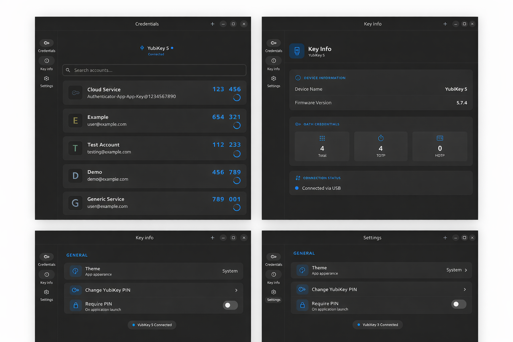

# Gosh Yubico Authenticator for Linux

A native GTK 4 / Adwaita desktop application for managing OATH (TOTP/HOTP)
credentials on YubiKey devices.

## Features

Manage OATH credentials with TOTP/HOTP code generation, password-protected
YubiKeys, touch-required credentials, clipboard auto-clear, QR import, and
system / light / dark theme support.

## Screenshots



## Quick Start

**Prerequisites:** Install `pcscd` (PC/SC Smart Card Daemon) for YubiKey
communication.

```bash
# Fedora/RHEL
sudo dnf install pcsc-lite

# Ubuntu/Debian
sudo apt install pcscd

# Arch Linux
sudo pacman -S pcsclite
```

**Enable and start the daemon:**

```bash
sudo systemctl enable --now pcscd
```

**Install the Flatpak (recommended):**

```bash
# From a release bundle:
flatpak install --user ./com.goshapps.YubicoAuthenticator.flatpak
flatpak run com.goshapps.YubicoAuthenticator

# Or build and install from this repository:
./build-flatpak.sh
```

The Flatpak talks to the **host** `pcscd` over the `pcsc` socket. Keep the
daemon running on the host; do not expect a daemon inside the sandbox.

**Other packages:**

```bash
# From a release tarball:
./gosh-authenticator

# Distro packages:
sudo dnf install gosh-authenticator-*.rpm
sudo apt install ./gosh-authenticator_*.deb
```

## Building from Source

**Build dependencies:** Rust 1.70+, GTK 4, libadwaita, libpcsclite-dev

```bash
# Ubuntu/Debian
sudo apt install build-essential pkg-config libgtk-4-dev libadwaita-1-dev libpcsclite-dev pcscd

# Fedora
sudo dnf install gcc pkgconf-pkg-config gtk4-devel libadwaita-devel pcsc-lite-devel

# Build the native binary
cd rust
cargo build --release
./target/release/gosh-authenticator
```

**Flatpak from source:**

```bash
sudo apt install flatpak flatpak-builder elfutils librsvg2-common
./build-flatpak.sh
```

`./build-flatpak.sh` installs the GNOME 50 SDK and the `rust-stable` extension
from Flathub, builds `com.goshapps.YubicoAuthenticator`, installs it for
the current user, and writes a `.flatpak` bundle under `dist/`.

If you change Rust dependencies, regenerate the offline crate sources:

```bash
python3 flatpak/generate-cargo-sources.py
```

## Troubleshooting

**PC/SC service not running:** Start with `sudo systemctl start pcscd`

**YubiKey not detected:** Check with `pcsc_scan` or verify pcscd is running

## License

GPL-3.0-or-later
