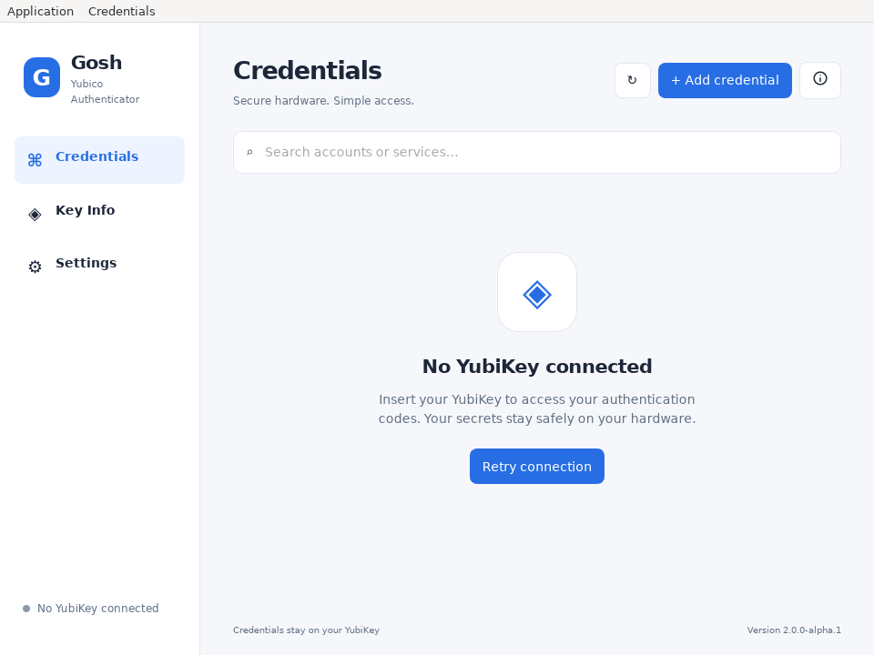
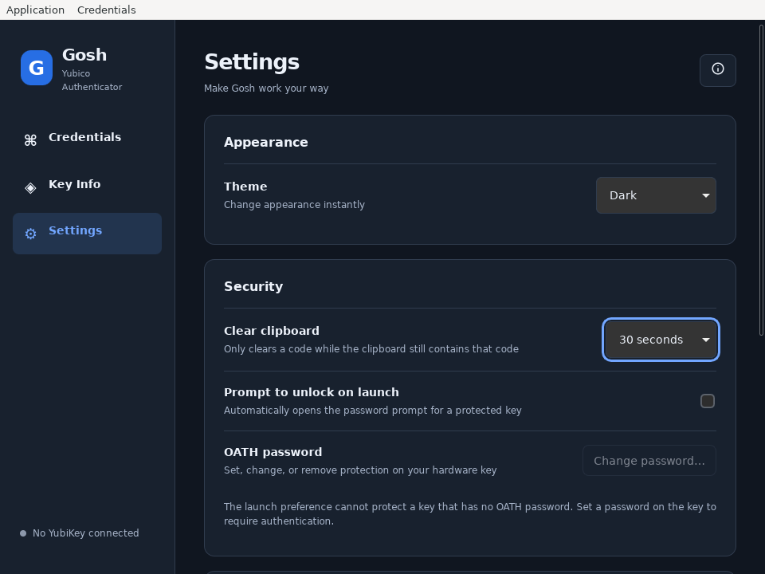

# Gosh Yubico Authenticator

A Rust and Dioxus Desktop application for managing OATH credentials on a YubiKey.
The 2.0 migration targets Windows, macOS and Linux, including Flatpak. Credentials
stay on the hardware key; the app uses the operating system's smart-card service.

**2.0.0-alpha.1 is a migration prerelease.** Linux software/runtime validation is
underway; native Windows/macOS, real-key interoperability and distribution signing
must be verified before a stable release. See [platform evidence](PLATFORM_SUPPORT.md)
and the [QA record](QA.md). Existing 1.x releases use the historical GTK frontend.

The app supports TOTP/HOTP, password unlock and protection changes, physical-touch
requests, search, manual credential entry, OTP URI paste and QR image import.
Custom periods and HOTP counters are preserved. Codes copy without spaces and
clear after the selected timeout while the clipboard still contains that code.
Settings include system/light/dark appearance, unlock prompting, service avatars
and optional favicon requests. Favicons are opt-in; account domains are never
sent automatically. Native menus, Ctrl/Cmd shortcuts and resizable layouts share
one command system. USB and touch behavior still require real-key QA.

Build and packaging instructions are in [BUILDING.md](BUILDING.md). Windows uses
WebView2 and WinSCard; macOS uses WKWebView and PCSC; Linux uses WebKitGTK 4.1 and
pcsc-lite. There is no Node/Electron runtime or frontend development server.
Linux users must start the host PC/SC daemon and enable the key's CCID interface.
The Flatpak manifest supports x86_64 and aarch64 with pinned, offline Cargo inputs.

The release workflow builds Windows MSI, Intel/Apple Silicon .app zip bundles,
Linux tar.gz/DEB/RPM and Flatpak bundles. These are advertised as verified downloads
only after the workflow succeeds and the artifacts are inspected. Windows MSI
requires WebView2; macOS bundles are currently ad-hoc signed and not notarized.
Linux tarballs require the system runtime libraries. No 2.0 stable release has
been published by this migration.

Linux preferences retain the legacy `gosh-authenticator/settings.json` path and
field names. New optional fields have defaults; unknown fields survive saves.
Malformed files remain intact with a visible error. Windows/macOS use their
standard configuration directories. Passwords, OTP secrets and codes are not
saved in preferences. See [ARCHITECTURE.md](ARCHITECTURE.md),
[MIGRATION_AUDIT.md](MIGRATION_AUDIT.md) and [SECURITY.md](SECURITY.md).

GPL-3.0-or-later. [LICENSE](LICENSE) and [THIRD_PARTY_LICENSES.html](THIRD_PARTY_LICENSES.html)
ship in native packages and Flatpak. This independent application is **not affiliated
with or endorsed by Yubico**. Yubico and YubiKey are trademarks of Yubico AB.
